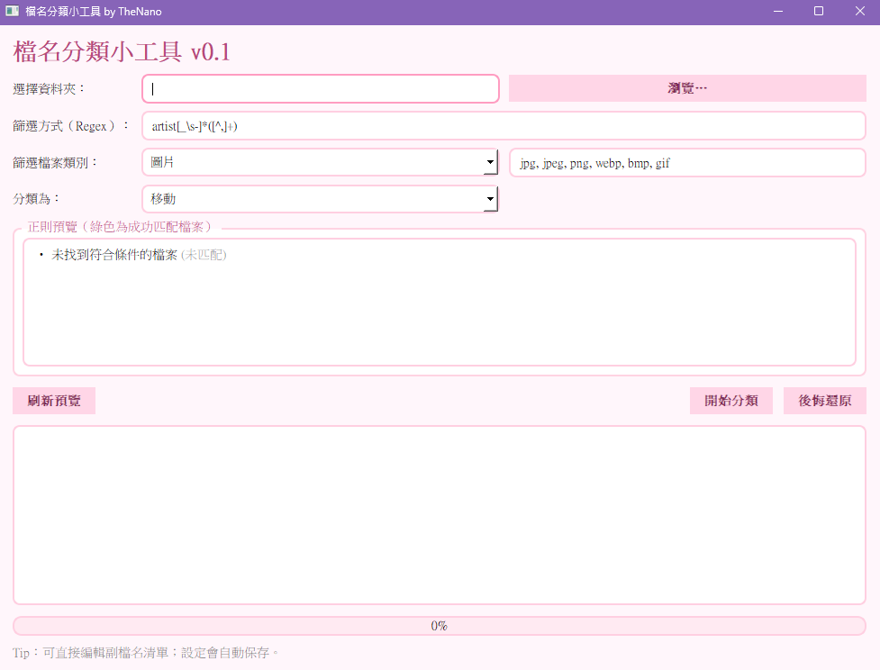

# 檔名分類小工具（Regex Sorter App）

一個用 **正則表達式（Regex）** 依檔名自動分類的超輕量工具。
支援 **移動 / 複製**、**副檔名過濾**、**預覽高亮**、**一鍵還原**，設定與還原紀錄皆儲存在 **應用程式同目錄**。
適合剛入門、想快速把大量圖片/文件按照檔名規則分到資料夾的人。

---

## 🖼️ 預覽畫面 (Preview)




## ✨ 功能亮點

* **依檔名規則自動分類**：用 Regex 從檔名抓出「第 1 個括號捕獲組」作為目標資料夾名。
* **兩種分類模式**：`移動`（Move）或 `複製`（Copy）。
* **副檔名過濾**：快速選「圖片 / 文件 / 其他」或自訂（逗號分隔）。
* **即時預覽**：清楚高亮第 1 組匹配，先看結果再動手。
* **安全不覆蓋**：同名目標自動改名為 `檔名 (1).ext`、`(2)`…
* **一鍵還原**：產生還原紀錄 JSON，`移動`可還原、`複製`可刪除複本。
* **設定與紀錄皆在 App 同目錄**：攜帶方便、免找路徑。

---

## 🧰 系統需求

* Windows / macOS / Linux（需 Python 3.8+）
* Python 套件：`PyQt5` (若使用exe版本則不需要)

安裝：

```bash
pip install PyQt5
```

---

## 🚀 快速開始

有兩種使用方式：

**方法一：直接執行 (Windows 使用者)**
1. 前往 [發布頁面](https://github.com/LittleSurvival/EasyFileClassifier/releases) 下載最新版本的 `EasyFileClassifier.exe`。
2. 將 `.exe` 放到任意資料夾，直接點兩下執行。

**方法二：透過 Python 執行 (跨平台)**
1. 確認已安裝 `系統需求` 中提到的環境。
2. 下載/放置 `main.py` 到任意資料夾。
3. 在該資料夾開啟終端機（CMD/PowerShell/Terminal）並執行：
   ```bash
   python main.py
   ```

### 介面操作

* **選擇資料夾**：指定要分類的來源資料夾（僅掃描該層，不含子資料夾）。
* **篩選方式（Regex）**：輸入正則表達式（預設：`artist[_\s-]*([^,]+)`）。
* **篩選檔案類別** 與 **副檔名清單**：選常用類型或自訂（逗號分隔，如 `jpg, png`）。
* **分類為**：選擇 `移動` 或 `複製`。
* **刷新預覽**：先看高亮匹配效果。
* **開始分類**：執行；進度條與下方主控台即時更新。
* **後悔還原**：用最近一次紀錄回復（或刪除複製品）。

---

## 🧩 核心概念（一定要懂的 3 件事）

1. **只看「第 1 個括號捕獲組」**
   你的 Regex 第一個 `(...)` 會被當作「目標資料夾名稱」。
   例：`r"artist[_\s-]*([^,]+)"`

   * 對 `artist - Alice, title - Hello.jpg`
   * 第 1 組：`Alice` → 會移到/複製到 `./Alice/` 下。

2. **副檔名過濾**
   只處理清單中的副檔名（例如 `jpg, png`）。
   若想**不限制類型**：把清單清空即可。

3. **非覆蓋式輸出**
   目的地有重名？程式會自動改名：`檔名 (1).ext`、`(2)`…，確保不會覆蓋原檔。

---

## 🔁 移動 vs 複製 & 還原行為

* **移動**：檔案從來源資料夾被移到對應子資料夾。

  * 會寫入一筆「從哪裡移到哪裡」的紀錄。
  * **後悔還原**：把檔案搬回原地。
* **複製**：在對應子資料夾產生一份副本，原檔不動。

  * 會寫入一筆「複製品在哪裡」的紀錄。
  * **後悔還原**：刪除那些複製品。

> 提醒：還原只針對該次操作生成的紀錄，不會影響你之後手動移動或編輯的檔案。

---

## 🗂️ 檔案與設定存放位置

全部都在 **應用程式同目錄**：

* `settings.ini`：介面各欄位的保存（路徑、Regex、類型、清單、模式…）。
* `_classify_moves_YYYYMMDD_HHMMSS.json`：每次分類的還原紀錄。

> 好處：整個資料夾帶著走，設定與紀錄也跟著走。

---

## 🧪 Regex 範例（可直接複製）

> 小技巧：在「預覽」可以馬上看第 1 組是否抓對。

* 依 `artist - Alice - title.jpg` 取出 `Alice`

  ```
  artist[_\s-]*([^,]+)
  ```
* 依 `Alice__2024_picture.png` 取 `Alice`

  ```
  ^([^_\- ]+)[_\- ]
  ```
* 依 `[Group] Title - 01.jpg` 取 `Group`

  ```
  ^\[(.+?)\]
  ```
* 依 `Title (Author).png` 取 `Author`

  ```
  \(([^)]+)\)
  ```
* 依 `cat-dog-bird.jpg` 取第一段 `cat`

  ```
  ^([^-\s]+)
  ```

> 原則：**你需要的目標資料夾名稱一定要放在第 1 個括號**。

---

## 🧭 操作步驟範例（從 0 到完成）

1. 把要整理的圖片放到 `C:\MyPics`。
2. 開啟程式 →「選擇資料夾」選 `C:\MyPics`。
3. 「篩選方式（Regex）」輸入：`^\[(.+?)\]`（取 `[作者]` 裡的文字）。
4. 「篩選檔案類別」選「圖片」，副檔名保留預設。
5. 「分類為」選擇 `移動`。
6. 按「刷新預覽」，確認高亮文字符合預期。
7. 按「開始分類」。
8. 分類完畢，如想回復 → 按「後悔還原」。

---

## ❗ 常見情況 & 錯誤排查

* **顯示「正則無效」**
  你的 Regex 語法錯了；先用簡單表達式測試（例如 `(.+)`），再逐步加強。
* **「未匹配」很多**
  可能 Regex 不對，或檔名格式不一致；調整 Regex 或先手動清理檔名。
* **沒有檔案被處理**

  * 來源資料夾是空的？
  * 副檔名清單太嚴格？（可清空以處理全部）
  * 程式只處理「該資料夾的檔案」，**不會遞迴子資料夾**。
* **權限不足 / 無法寫入**

  * 目標資料夾沒有寫入權限。
  * 嘗試以系統管理員 / sudo 執行，或換到可寫入位置。
* **還原找不到檔案**

  * 你在分類後又手動移動/刪除過；還原會盡量處理，找不到會顯示「跳過」。

---

## 🧷 小技巧

* 想「處理所有副檔名」→ 把副檔名輸入框清空。
* 想「避免誤動」→ 先用 `複製` 模式測試流程，確認結果正確後再改 `移動`。
* 預覽最多顯示 100 筆，目的是讓你快速確認 Regex 是否抓對。
* 若你常用固定規則，可把 `settings.ini` 一起帶著走，免重設。
